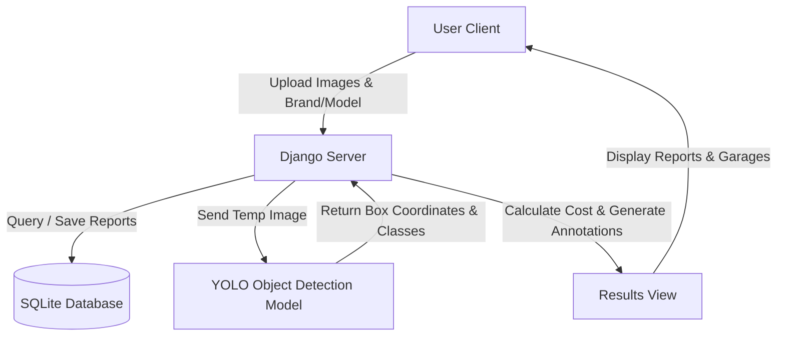

# 🚗 DECOR — Damage Estimation and Cost of Repairs

[](https://www.python.org/)
[](https://www.djangoproject.com/)
[](https://docs.ultralytics.com/)
[](https://tailwindcss.com/)
[](LICENSE)

**DECOR** is an advanced, AI-powered diagnostic and estimation system designed to evaluate automotive collision damage. By combining high-performance computer vision with localized repair pricing models, DECOR detects exterior vehicle damage, identifies affected parts, and generates detailed cost breakdowns in seconds.

---

## ✨ Features

- **🔍 AI-Powered Detection**: Leverages **YOLOv11/v8** models to automatically scan and identify damage on 7 major vehicle zones: *Bonnet, Bumper, Dickey, Door, Fender, Light, and Windshield*.
- **💰 Smart Repair Costing**: Integrates with a localized SQL database containing model-specific parts pricing across 10 major automotive brands (including Suzuki, Honda, Toyota, Hyundai, BMW, Skoda, etc.).
- **🗺️ Geolocation-Aware Garage Locator**: Helps users find nearby repair facilities using a resilient **three-tier mapping architecture** (Google Places API ➔ OpenStreetMap Overpass Fallback ➔ Local Demo Fallback).
- **🎨 Premium HUD Styling**: A modern, dark-mode cockpit interface utilizing a sleek glassmorphic theme, responsive dashboard inputs, dynamic dropdown mapping, and interactive original/annotated image tab toggling.
- **🛡️ Secure Operations**: Decouples sensitive environment variables and credentials from source code tracking using strict gitignore parameters.

---

## 🛠️ Tech Stack

- **Backend**: Python, Django
- **Database**: SQLite (local) / MySQL Support
- **Machine Learning & Image Manipulation**: Ultralytics (YOLO), PyTorch, OpenCV, Pillow
- **Frontend**: Tailwind CSS, Material Symbols Outlined, Google Fonts (Barlow Condensed, DM Sans, JetBrains Mono)
- **APIs**: Google Maps JavaScript API & Google Places Library, OpenStreetMap Overpass API

---

## ⚙️ Architecture



---

## 🚀 Setup & Installation

### 1. Clone the Repository
```bash
git clone https://github.com/vinay-mudhiraj18/decor-damage_estimation_and_cost_of_repairs_for_cars.git
cd decor-damage_estimation_and_cost_of_repairs_for_cars
```

### 2. Configure Your Virtual Environment
```bash
# Create environment
python -m venv venv

# Activate environment (Windows)
.\venv\Scripts\activate

# Activate environment (Mac/Linux)
source venv/bin/activate
```

### 3. Install Dependencies
```bash
pip install -r requirements.txt
```

### 4. Setup Environment Variables
Create a local `.env` file in the root directory by copying the template file:
```bash
cp .env.example .env
```
Open `.env` and fill in your variables:
```env
SECRET_KEY=your_django_secret_key
DEBUG=True
GOOGLE_MAPS_API_KEY=your_google_maps_api_key
```

### 5. Apply Database Migrations
```bash
python manage.py migrate
```

### 6. Launch the Development Server
```bash
python manage.py runserver
```
Visit `http://127.0.0.1:8000/` in your browser.

---

## 🧠 Model Specifications

The object detection pipeline classifies damages across 7 distinct parts:
| Class Index | Class Name | Target Part |
|:---:|---|---|
| **0** | Bonnet | Engine Hood / Front Panel |
| **1** | Bumper | Front and Rear Bumpers |
| **2** | Dickey | Trunk / Boot Panel |
| **3** | Door | Side Passenger/Driver Doors |
| **4** | Fender | Wheel Arch Panels |
| **5** | Light | Headlamps and Tail-lights |
| **6** | Windshield | Front and Rear Glass Panels |

Model weights are saved locally under `/models/model weights/best.pt`.

---

## 🏷️ Keywords & Hashtags

### Keywords
`car damage detection`, `repair for cars`, `car repair cost estimation`, `vehicle collision diagnostics`, `YOLO car damage detector`, `auto body repair estimator`, `auto dent repair`, `mechanical shop finder`, `car repair estimate`

### Hashtags
`#CarDamageDetection` `#RepairForCars` `#AutoBodyRepair` `#CarRepairEstimate` `#YOLO` `#Django` `#ComputerVision` `#VehicleDiagnostics` `#CarMaintenance`

---

## 🛡️ License

Distributed under the MIT License. See `LICENSE` for more information.
