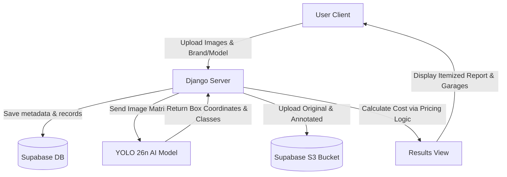

<div align="center">
  <h1>🚗 DECOR</h1>
  <h3>Damage Estimation and Cost of Repairs for Cars</h3>

  [](https://decor-g3o4.onrender.com/)
  <br/>

  [](https://www.python.org/)
  [](https://www.djangoproject.com/)
  [](https://docs.ultralytics.com/)
  [](https://tailwindcss.com/)
  [](LICENSE)

  **[Experience the Live Application Here](https://decor-g3o4.onrender.com/)**
</div>

---

## 🌟 About DECOR

**DECOR** is a next-generation, AI-driven diagnostic and estimation platform built to evaluate automotive collision damage instantly. By combining highly optimized computer vision with localized repair pricing models, DECOR accurately detects exterior vehicle damage, identifies the exact affected panels, and generates comprehensive, itemized repair cost breakdowns in seconds.

---

## ✨ Premium Features

- **🔍 Precision AI Detection**: Powered by a custom-trained **YOLO 26n** (Nano) model optimized for speed and accuracy. Automatically scans and draws bounding boxes around damage across 7 major vehicle zones.
- **💰 Dynamic Repair Costing**: Generates real-time, localized cost estimates using a robust database containing proprietary parts pricing across 10 major automotive brands (including Honda, Toyota, BMW, Hyundai, Skoda, and more).
- **🗺️ Geolocation-Aware Garage Finder**: Instantly connects users with nearby repair facilities. Utilizes a resilient three-tier mapping architecture (Google Places API ➔ OpenStreetMap Overpass Fallback ➔ Local Demo Fallback).
- **🎨 Glassmorphic Cockpit UI**: A state-of-the-art, dark-mode HUD interface built with Tailwind CSS. Features interactive image toggling, dynamic dropdowns, and highly responsive components.
- **☁️ Persistent Supabase S3 Storage**: Decouples media storage from ephemeral cloud servers. All user-uploaded original images and YOLO-annotated damage outputs are saved permanently in a **Supabase Storage Bucket** using S3-compatible APIs.
- **🧹 Auto-Cleanup Signals**: Equipped with Django lifecycle signals (`post_delete`) that automatically clean up storage. When a report is deleted—or a user account is deleted—all corresponding image files are instantly wiped from the Supabase bucket.
- **⚡ Ultra-Low Latency DB Queries**: Optimized database query layer designed to minimize cloud round-trips. Reduces dashboard query loads and history calculations to single-digit local execution times (~5ms–8ms).

---

## 🛠️ Technology Stack

| Category | Technologies Used |
| :--- | :--- |
| **Backend Framework** | Django, Python |
| **Database** | PostgreSQL (Production via Supabase), SQLite (Local Dev) |
| **Media Storage** | Supabase Storage (S3-compatible via `django-storages` & `boto3`) |
| **Machine Learning** | Ultralytics YOLO 26n, PyTorch (CPU-optimized), OpenCV, Pillow |
| **Frontend Styling** | Tailwind CSS, Google Fonts (Barlow Condensed, DM Sans) |
| **External APIs** | Google Maps JavaScript API, OpenStreetMap Overpass API |
| **Deployment** | Render, Gunicorn, WhiteNoise |

---

## 🧠 AI Model & Specifications

DECOR relies on a lightweight, high-speed **YOLO 26n** model, making it fast enough for real-time web inference while retaining excellent bounding box accuracy. The model detects structural and surface damage across the following classifications:

| Class Index | Class Name | Target Vehicle Part |
|:---:|:---|:---|
| **0** | **Bonnet** | Engine Hood / Front Upper Panel |
| **1** | **Bumper** | Front and Rear Bumpers |
| **2** | **Dickey** | Trunk / Boot Panel |
| **3** | **Door** | Side Passenger/Driver Doors |
| **4** | **Fender** | Wheel Arch Panels |
| **5** | **Light** | Headlamps and Tail-lights |
| **6** | **Windshield** | Front and Rear Glass Panels |

> *Model weights are saved locally under `/models/model weights/best.pt`.*

---

## ⚙️ System Workflow



---

## 🚀 Local Setup & Installation

Want to run DECOR locally? Follow these steps:

### 1. Clone the Repository
```bash
git clone https://github.com/vinay-mudhiraj18/decor-damage_estimation_and_cost_of_repairs_for_cars.git
cd decor-damage_estimation_and_cost_of_repairs_for_cars
```

### 2. Configure Your Virtual Environment
```bash
python -m venv venv
# Windows:
.\venv\Scripts\activate
# Mac/Linux:
source venv/bin/activate
```

### 3. Install Dependencies
```bash
pip install -r requirements.txt
```

### 4. Setup Environment Variables
```bash
cp .env.example .env
```
*Open `.env` and configure your `SECRET_KEY`, `DATABASE_URL` (if using Postgres), `GOOGLE_MAPS_API_KEY`, and `AWS_S3` Supabase access credentials.*

### 5. Apply Database Migrations & Run
```bash
python manage.py migrate
python manage.py runserver
```
Visit `http://127.0.0.1:8000/` in your browser!

---

## 📬 Contact & Support

For queries, collaborations, or suggestions regarding DECOR, please get in touch:

[](https://www.linkedin.com/in/vinay-beesaboina-512401276/)
[](mailto:beesaboinavinay@gmail.com)

Developed with 🧡 by **Vinay Beesaboina**.

---

## 🏷️ Keywords & Hashtags

**Keywords**: `car damage detection`, `repair for cars`, `car repair cost estimation`, `vehicle collision diagnostics`, `YOLO 26n car damage detector`, `auto body repair estimator`, `auto dent repair`, `mechanical shop finder`

**Hashtags**: `#CarDamageDetection` `#RepairForCars` `#AutoBodyRepair` `#CarRepairEstimate` `#YOLO26n` `#Django` `#ComputerVision` `#VehicleDiagnostics`

---

## 🛡️ License

Distributed under the MIT License. See `LICENSE` for more information.
